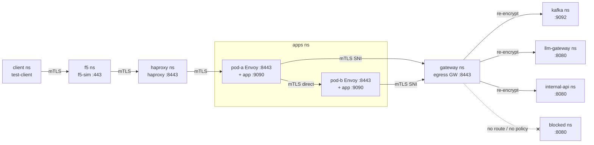

# envoy-sidecar-test

Toy test stack for an Envoy **mTLS sidecar + egress gateway** pattern.  
It validates the full traffic chain — external client through an F5/HAProxy simulation,
into two application pods, and back out through a shared egress gateway — before the
pattern is integrated into a production application chart.

**Topology:** every component runs in its own namespace (`f5`, `haproxy`, `apps`,
`gateway`, `client`, `kafka`, `internal-api`, `llm-gateway`, `blocked`) to mirror a real
multi-tenant cluster.

**Two enforcement planes:**

- **Sidecars** handle **inbound** — terminate client mTLS and enforce the CN whitelist
  (dev: off, qa: shadow/logged, prod: enforced) plus JWT injection. **The client CN is
  only used to authorize requests into Pod A.**
- **Egress gateway** (a standalone Envoy) handles **outbound** — pods open mTLS to it with
  a per-target SNI; it terminates, authorizes by the pod's **client-cert CN**, and
  re-encrypts to the upstream. Pod-to-pod (pod-a→pod-b) stays direct sidecar-to-sidecar.

> 📋 Full end-to-end **sequence diagram** with every component, port, certificate, and the
> NetworkPolicy backstop: **[docs/SEQUENCE.md](docs/SEQUENCE.md)**.

---

## Setup

**Everything runs on your local machine — no cloud account, no VM, no remote cluster.**  
`make cluster` creates a Kubernetes cluster inside Docker using [Kind](https://kind.sigs.k8s.io/).  
The cluster and all pods are Docker containers on your machine. `make down` cleans everything up.

Pick your OS below and follow the steps in order.

---

### Windows

> **Do not use Git Bash or PowerShell.** The Makefile and cert scripts require bash.  
> Everything below is done inside a **WSL2 terminal** (Ubuntu running inside Windows).

#### Step 1 — Install WSL2

Open **PowerShell as Administrator** (right-click the Start menu → "Windows PowerShell (Admin)") and run:

```powershell
wsl --install
```

This installs WSL2 with Ubuntu. **Restart your computer when prompted.**

After rebooting, Ubuntu will launch automatically and ask you to create a username and password. Do that — this is your Linux account inside Windows.

> If you already have WSL but an older version, run `wsl --update` and `wsl --set-default-version 2`.

#### Step 2 — Open a WSL2 terminal

You'll use this terminal for everything from here on.

- Press the **Windows key**, type **Ubuntu**, click it. A black terminal window opens.
- Or: open **Windows Terminal** (install it from the Microsoft Store if you don't have it) and pick **Ubuntu** from the tab dropdown. This is nicer.

You're now inside Linux. Your Windows files are at `/mnt/c/Users/yourname/` but **don't work there** — file I/O across the Windows/Linux boundary is slow and causes subtle issues with `make`. Keep this project on the Linux filesystem.

#### Step 3 — Install Docker Desktop

Download and install **[Docker Desktop for Windows](https://docs.docker.com/desktop/install/windows-install/)**.

During or after install, open Docker Desktop and go to:  
**Settings** (gear icon, top right) **→ Resources → WSL Integration**

- Make sure **"Enable integration with my default WSL distro"** is ticked.
- If you see your Ubuntu distro listed separately, toggle it on too.
- Click **Apply & Restart**.

Go back to your Ubuntu terminal and verify Docker is working:

```bash
docker ps
```

Expected output: an empty table with column headers (no error). If you get `permission denied` or `Cannot connect`, Docker Desktop is not running or the WSL integration wasn't saved — recheck the settings above.

#### Step 4 — Install the project tools

> ⚠️ `sudo apt install kind helm kubectl helmfile` **will not work** — these tools are not in Ubuntu's default package repository. The script below installs them from their official sources.

In your Ubuntu terminal, clone this repo onto the **Linux** filesystem and run the install script:

```bash
# Clone into your Linux home directory (fast — stays on the Linux filesystem)
cd ~
git clone https://github.com/samdewaele/envoy-sidecar-test.git
cd envoy-sidecar-test

# Install all required tools
chmod +x scripts/install-tools-wsl2.sh
./scripts/install-tools-wsl2.sh
```

The script installs: `make`, `openssl`, `kubectl`, `helm`, `kind`, `helmfile`, and the `helm-diff` plugin.  
It takes about 2 minutes. Docker is skipped — it's already handled by Docker Desktop.

#### Step 5 — Verify everything is ready

```bash
docker ps           # should show an empty table, no error
kind version        # kind v0.23.x
kubectl version --client --short
helm version --short
helmfile --version
```

All five commands should print a version number without errors. If any fail, re-run the install script or check the error message.

You're ready. Continue to [Quick start](#quick-start) below.

---

### macOS

#### Step 1 — Install Homebrew

If you don't have it yet:

```bash
/bin/bash -c "$(curl -fsSL https://raw.githubusercontent.com/Homebrew/install/HEAD/install.sh)"
```

#### Step 2 — Install Docker Desktop

Download **[Docker Desktop for Mac](https://docs.docker.com/desktop/install/mac-install/)** and drag it to Applications.  
Start it, wait for the whale icon to appear in the menu bar (that means it's running).

#### Step 3 — Install the project tools

```bash
brew install kind kubectl helm helmfile openssl

# helm-diff plugin — required by helmfile, not bundled with helm
helm plugin install https://github.com/databus23/helm-diff
```

#### Step 4 — Clone and verify

```bash
git clone https://github.com/samdewaele/envoy-sidecar-test.git
cd envoy-sidecar-test
docker ps && kind version && kubectl version --client --short && helm version --short && helmfile --version
```

All commands should print without errors. Continue to [Quick start](#quick-start).

---

### Linux (native)

```bash
# Basic tools
sudo apt install -y make git curl openssl

# kubectl — needs the Kubernetes apt repo (not in default Ubuntu repos)
sudo mkdir -p /etc/apt/keyrings
curl -fsSL https://pkgs.k8s.io/core:/stable:/v1.29/deb/Release.key \
  | sudo gpg --dearmor -o /etc/apt/keyrings/kubernetes-apt-keyring.gpg
echo "deb [signed-by=/etc/apt/keyrings/kubernetes-apt-keyring.gpg] \
https://pkgs.k8s.io/core:/stable:/v1.29/deb/ /" \
  | sudo tee /etc/apt/sources.list.d/kubernetes.list
sudo apt update && sudo apt install -y kubectl

# helm — official install script
curl https://raw.githubusercontent.com/helm/helm/main/scripts/get-helm-3 | bash

# kind — binary (not in apt)
curl -Lo /tmp/kind https://kind.sigs.k8s.io/dl/v0.23.0/kind-linux-amd64
chmod +x /tmp/kind && sudo mv /tmp/kind /usr/local/bin/kind

# helmfile — binary (not in apt)
curl -fsSLo /tmp/helmfile.tar.gz \
  https://github.com/helmfile/helmfile/releases/download/v0.162.0/helmfile_0.162.0_linux_amd64.tar.gz
tar -xzf /tmp/helmfile.tar.gz -C /tmp helmfile && sudo mv /tmp/helmfile /usr/local/bin/

# helm-diff plugin — required by helmfile, not bundled with helm
helm plugin install https://github.com/databus23/helm-diff

# docker engine
curl -fsSL https://get.docker.com | sh
sudo usermod -aG docker $USER   # then log out and back in

# clone
git clone https://github.com/samdewaele/envoy-sidecar-test.git
cd envoy-sidecar-test
```

---

## Quick start

```bash
make cluster   # 1. Kind cluster + Calico CNI
make push      # 2. build the testapp image + load it into the Kind nodes
make certs     # 3. CA, leaf certs, JWT keypair → create namespaces + secrets
make dev       # 4. deploy (push + certs + plugins run automatically)
make test-dev  # 5. smoke test
```

### 1. Create the cluster

```bash
make cluster
```

Creates a Kind cluster with the default CNI disabled, **Calico** installed (required for
NetworkPolicy), and NodePort `30443` mapped to `localhost:30443`.

### 2. Build and load the testapp image

```bash
make push
```

Builds `testapp/main.go` into a minimal Go binary and loads it into the Kind nodes with
`kind load docker-image` — no registry required. One image serves Pod A, Pod B, and every
mock; the role is selected by the `APP_ROLE` env var (`pod-a` | `pod-b` | `mock`).

### 3. Generate certificates and namespaces

```bash
make certs
```

`scripts/generate-certs.sh` creates a self-signed CA, the leaf certs and JWT keypair,
**all nine namespaces**, and distributes the secrets:

| Secret | Namespace(s) | Contains | Used by |
|---|---|---|---|
| `f5-sim-certs` | `f5` | `tls.{crt,key}`, `ca.crt` (CN=`f5-sim`) | f5-sim |
| `haproxy-certs` | `haproxy` | `haproxy.pem`, `ca.crt` (CN=`haproxy`) | HAProxy |
| `envoy-certs-pod-a` | `apps` | `tls.{crt,key}`, `ca.crt` (CN=`pod-a`) | Pod A Envoy |
| `envoy-certs-pod-b` | `apps` | `tls.{crt,key}`, `ca.crt` (CN=`pod-b`) | Pod B Envoy |
| `gateway-certs` | `gateway` | `tls.{crt,key}`, `ca.crt` (CN=`gateway`) | egress gateway |
| `mock-certs` | `kafka`, `llm-gateway`, `internal-api`, `blocked` | `tls.{crt,key}`, `ca.crt` (CN=`mock-target`) | mock targets |
| `client-certs` | `client` | `client.{crt,key}`, `ca.crt` (CN=`test-client`) | test client |
| `envoy-jwt-token` | `apps` | `jwt.token` (pre-signed RS256 JWT) | Pod A/B Envoy only |
| `app-jwt-pubkey` | `apps` | `jwt.pub` (RSA public key) | Pod A/B app only |

Pod A and Pod B get **distinct identity certs** (`CN=pod-a` / `CN=pod-b`) so the gateway can
authorize egress per pod.

> **Note**: `certs/` is in `.gitignore`. Never commit private keys.

---

## Testing

Deploy a mode, then run its smoke test, or run the full connectivity probe:

```bash
make dev   && make test-dev    # deploy + smoke test
make qa    && make test-qa
make prod  && make test-prod

make probe                     # full connectivity matrix (valid + invalid + netpol)
```

### `make probe` — full connectivity matrix

After any deploy, `make probe` exercises **every** connection — the ones that must work
and the ones that must be blocked — and prints a pass/fail table. A correctly-blocked
connection counts as ✅ (the observed behaviour matched the expectation). It returns
non-zero if any cell disagrees, so it doubles as a post-deploy gate.

For a **live** view, `make probe-watch` re-runs the request matrix every 5 seconds as a
refreshing dashboard (`make probe-watch INTERVAL=10` to change the cadence; Ctrl-C to stop).
It's handy for watching behaviour while you tail logs or change config. The watch loop runs
the inbound + egress requests only; the slower kernel-level NetworkPolicy timeout checks run
in the one-shot `make probe`.

```
════ INBOUND — sidecar mTLS + CN whitelist (Pod A) ═══════════════════
  ✅ client WITH valid cert → pod-a /health             (ALLOW)
  ✅ client WITHOUT cert    → pod-a /health             (DENY)
════ POD A EGRESS — via gateway, authorized by CN=pod-a ══════════════
  ✅ pod-a → pod-b        (direct east-west)            (ALLOW)
  ✅ pod-a → kafka        (gateway)                     (ALLOW)
  ✅ pod-a → llm-gateway  (gateway)                     (ALLOW)
  ✅ pod-a → internal-api (CN not authorized)           (DENY)
  ✅ pod-a → blocked      (no route)                    (DENY)
════ POD B EGRESS — via gateway, authorized by CN=pod-b ══════════════
  ✅ pod-b → internal-api (gateway)                     (ALLOW)
  ✅ pod-b → llm-gateway  (CN not authorized)           (DENY)
  ✅ pod-b → blocked      (no route)                    (DENY)
════ NETWORKPOLICY — pods cannot reach upstreams directly ════════════
  ✅ pod-a → kafka-mock        DIRECT (kernel drop)     (DROPPED)
  ✅ pod-a → internal-api-mock DIRECT (kernel drop)     (DROPPED)
```

### What each mode changes

Mode controls **only the sidecar's inbound RBAC** on Pod A. mTLS, JWT injection, and the
**egress gateway authorization are always on** in every mode.

| | DEV | QA | PROD |
|---|---|---|---|
| mTLS on every hop | ✅ | ✅ | ✅ |
| JWT injection + validation | ✅ | ✅ | ✅ |
| Gateway egress authz (CN + route) | ✅ | ✅ | ✅ |
| Inbound CN/CIDR whitelist on Pod A | not loaded | shadow — **logged** | enforced — **blocked** |

### The egress authorization matrix (identical in every mode)

`make test-*` runs a shared matrix. Pod A is driven through the real ingress chain
(client → f5 → haproxy → pod-a); Pod B's egress is driven by exec'ing into its app
container and hitting the sidecar's local egress ports (the client cannot reach Pod B).

| From | pod-b (direct) | kafka | llm-gateway | internal-api | blocked |
|---|---|---|---|---|---|
| **pod-a** | ✅ direct | ✅ via gw | ✅ via gw | ❌ CN denied | ❌ no route |
| **pod-b** | — | ✅ via gw | ❌ CN denied | ✅ via gw | ❌ no route |

Expected `make test-prod` output:

```
── warming up ingress chain + gateway (cold-start guard) ───────
  ✅ chain ready
── Pod A egress (client → f5 → pod-a) ──────────────────────────
  ✅ pod-a → pod-b (direct)
  ✅ pod-a → kafka (gateway)
  ✅ pod-a → llm-gateway (gateway)
→ pod-a → internal-api must be DENIED (gateway: CN not authorized)
  ✅ denied by CN
→ pod-a → blocked must be DENIED (gateway: no route)
  ✅ denied (no route)
── Pod B egress (exec → sidecar local egress ports) ────────────
  ✅ pod-b → internal-api (gateway)
→ pod-b → llm-gateway must be DENIED (gateway: CN not authorized)
  ✅ denied by CN
→ pod-b → blocked must be DENIED (gateway: no route)
  ✅ denied (no route)

════ PROD smoke test ════
  ✅ health via f5 (inbound RBAC enforced, CN=test-client)
→ Rejection without client cert (must fail the mTLS handshake)
  ✅ rejected without client cert
✅  PROD passed
```

- **dev/qa** run the same egress matrix; `test-qa` additionally tails Pod A's Envoy log so
  you can see the inbound `shadow_result` (qa evaluates the CN whitelist but never blocks).
- **prod** additionally proves a request **without** a client cert is rejected at the
  mTLS handshake.

### Inspecting individual calls

```bash
# Full outbound summary from Pod A, through the real ingress chain:
kubectl exec -n client client -- curl -sf \
  --cert /certs/client.crt --key /certs/client.key --cacert /certs/ca.crt \
  https://f5-sim.f5.svc.cluster.local/call-all
```

### Verifying JWT injection

The sidecar's Lua filter injects a signed RS256 JWT on every inbound request; the app
validates it and rejects anything that bypassed Envoy.

```bash
# See the injected header echoed back:
kubectl exec -n client client -- curl -sf \
  --cert /certs/client.crt --key /certs/client.key --cacert /certs/ca.crt \
  https://f5-sim.f5.svc.cluster.local/echo
# → headers include  X-Envoy-Internal-Jwt: Bearer eyJ...

# Bypass Envoy by hitting the app directly inside the pod:
kubectl exec -n apps deploy/pod-a -c app -- \
  curl -sf http://127.0.0.1:9090/echo
# → 401  (missing internal auth header — /echo requires the JWT; /health is exempt)
```

### Verifying NetworkPolicy

NetworkPolicy enforcement is independent of Envoy and the gateway. From Pod A's app
container, a destination outside the egress allow-list is dropped at the kernel:

```bash
# direct to a mock — DROPPED (pods may egress only to the gateway):
kubectl exec -n apps deploy/pod-a -c app -- \
  curl -m 5 -s -o /dev/null -w 'exit=%{exitcode}\n' \
  http://kafka-mock.kafka.svc.cluster.local:9092/
# → times out (exit 28) — the packet never leaves the pod

# to the gateway — ALLOWED (connection establishes):
kubectl exec -n apps deploy/pod-a -c app -- \
  curl -m 5 -s -o /dev/null -w 'connected\n' \
  https://gateway.gateway.svc.cluster.local:8443/ ; echo "(TLS will fail for a bare curl, but the packet is permitted)"
```

The legitimate path (app → its sidecar's local egress port → gateway) is exactly what the
egress matrix exercises.

### Checking Envoy / gateway admin

Admin is bound to `127.0.0.1:9901` (never exposed). Port-forward to inspect:

```bash
# Gateway egress filter chains, clusters, RBAC counters:
kubectl port-forward -n gateway deploy/gateway 9901:9901
curl http://localhost:9901/listeners
curl http://localhost:9901/clusters
curl 'http://localhost:9901/stats?filter=rbac'

# Pod A sidecar:
kubectl port-forward -n apps deploy/pod-a 9901:9901
```

### Live logs

```bash
make logs-f5        # f5-sim (nginx)
make logs-haproxy   # HAProxy
make logs-a         # Pod A Envoy
make logs-b         # Pod B Envoy
make logs-gw        # egress gateway
```

### Log reference

| Log line | Meaning |
|---|---|
| `shadow_result=DENY` | QA inbound: request would be blocked by the CN whitelist in PROD |
| `shadow_result=ALLOW` | QA inbound: request passed the whitelist |
| `shadow_result=-` | DEV inbound: RBAC filter not loaded |
| `RESPONSE_FLAGS=DC` / connection reset | gateway denied egress (CN) or no SNI route |
| `401 missing internal auth header` | request reached the app without the injected JWT |

---

## Switching environments

```bash
make dev    # → helmfile -e dev  apply
make qa     # → helmfile -e qa   apply
make prod   # → helmfile -e prod apply
```

Helmfile merges `helm/values.yaml` + the environment overlay and passes the result to the
release. The image is injected via `TESTAPP_IMAGE` (set at the top of the Makefile).
OpenShift overlays also exist: `helmfile -e openshift-{dev,qa,prod} apply` (drops fixed
UIDs for the restricted SCC, disables the toy f5-sim/haproxy tiers). Preview a change with
`helmfile -e prod diff`.

---

## Architecture

### Egress gateway

Pods do not reach external systems directly. Each sidecar tunnels every external target to
the shared egress gateway over mTLS, setting the **SNI to the target name**. The gateway
reads the SNI to route, terminates the pod's mTLS, authorizes the pod's **client-cert CN**
for that target, then re-encrypts (fresh mTLS) to the real upstream.

```mermaid
sequenceDiagram
    autonumber
    participant C as Client<br/>client ns
    participant F as f5-sim<br/>f5 ns :443
    participant H as HAProxy<br/>haproxy ns :8443
    participant EA as Pod A Envoy<br/>apps ns :8443
    participant AA as Pod A app<br/>127.0.0.1:9090
    participant EB as Pod B Envoy<br/>apps ns :8443
    participant AB as Pod B app<br/>127.0.0.1:9090
    participant GW as Egress GW<br/>gateway ns :8443
    participant K as kafka-mock<br/>kafka ns :9092
    participant I as internal-api<br/>internal-api ns :8080
    participant BL as blocked-mock<br/>blocked ns :8080

    rect rgb(235,245,255)
    Note over C,EA: INBOUND — mTLS terminated + CN whitelisted by the sidecar
    C->>F: TLS to f5-sim.f5.svc:443 (GET /call-kafka)
    Note over C,F: HOP1 mTLS · f5 server cert CN=f5-sim ·<br/>client cert CN=test-client · f5 verifies vs CA
    Note over F: extract CN → header X-SSL-Client-CN: test-client
    F->>H: HTTP/1.1 to haproxy.haproxy.svc:8443
    Note over F,H: HOP2 mTLS (re-encrypt) · f5 client cert CN=f5-sim ·<br/>haproxy server cert CN=haproxy
    H->>EA: to pod-a-service.apps.svc:8443
    Note over H,EA: HOP3 mTLS (re-encrypt) · haproxy client cert CN=haproxy ·<br/>Pod A server cert CN=pod-a · require_client_certificate
    Note over EA: HTTP RBAC: X-SSL-Client-CN==test-client OR src∈10.0.0.0/8 → ALLOW<br/>Lua injects X-Envoy-Internal-JWT (RS256, signed by jwt.key)
    EA->>AA: HTTP 127.0.0.1:9090 (local_app)
    Note over AA: validate JWT with jwt.pub → handle /call-kafka
    end

    rect rgb(235,255,235)
    Note over AA,K: EGRESS (allowed) — pod-a → kafka via gateway
    AA->>EA: plain TCP 127.0.0.1:19092
    EA->>GW: mTLS to gateway.gateway.svc:8443, SNI=kafka
    Note over EA,GW: cluster gw_kafka · Pod A client cert CN=pod-a · GW server cert CN=gateway
    Note over GW: SNI=kafka → filter chain [kafka] · terminate mTLS ·<br/>network RBAC CN∈{pod-a,pod-b} → ALLOW
    GW->>K: mTLS (re-encrypt) to kafka-mock.kafka.svc:9092 (GW cert CN=gateway)
    K-->>AA: PONG ↩ back through GW → EA → app → HTTP 200 to client
    end

    rect rgb(255,240,235)
    Note over AA,I: EGRESS (denied by CN) — pod-a → internal-api
    AA->>EA: plain TCP 127.0.0.1:19094
    EA->>GW: mTLS to gateway:8443, SNI=internal-api (CN=pod-a)
    Note over GW: chain [internal-api] · RBAC allowed CN={pod-b} · pod-a ∉ → DENY
    GW--xEA: reset
    Note over AA: app → HTTP 502 to client
    end

    rect rgb(255,235,235)
    Note over AA,BL: EGRESS (denied, no route) — → blocked
    AA->>EA: plain TCP 127.0.0.1:19999
    EA->>GW: mTLS to gateway:8443, SNI=blocked
    Note over GW: no filter chain for [blocked] → connection closed
    GW--xEA: reset
    Note over AA: app → HTTP 502 (blocked-mock never contacted)
    end

    rect rgb(245,235,255)
    Note over AA,AB: POD A → POD B (direct east-west, NOT via gateway)
    AA->>EA: plain HTTP 127.0.0.1:19080
    EA->>EB: mTLS to pod-b-service.apps.svc:8443 (Pod A cert CN=pod-a, Pod B cert CN=pod-b)
    Note over EB: RBAC matches via src∈10.0.0.0/8 · Lua injects JWT
    EB->>AB: HTTP 127.0.0.1:9090 → validate JWT → /echo → HTTP 200
    end

    rect rgb(235,255,235)
    Note over EB,I: POD B EGRESS — internal-api allowed; llm-gateway denied by CN
    AB->>EB: plain TCP 127.0.0.1:19094
    EB->>GW: mTLS SNI=internal-api (CN=pod-b)
    Note over GW: RBAC allowed CN={pod-b} → ALLOW
    GW->>I: mTLS (re-encrypt) to internal-api-mock.internal-api.svc:8080
    Note over AB,GW: (pod-b → SNI=llm-gateway would be DENIED: allowed CN={pod-a})
    end
```

The gateway blocks two ways:

- **CN denied** — the SNI route exists but the calling pod's CN is not authorized for it.
- **No route** — the SNI has no filter chain (e.g. `blocked`); Envoy rejects the connection.

The routing + authorization table lives in `helm/values.yaml` under `gateway.routes`:

```yaml
gateway:
  routes:
    - { sni: kafka,        upstreamHost: kafka-mock,        upstreamNamespace: kafka,        upstreamPort: 9092, allowedCNs: [pod-a, pod-b] }
    - { sni: llm-gateway,  upstreamHost: llm-gateway-mock,  upstreamNamespace: llm-gateway,  upstreamPort: 8080, allowedCNs: [pod-a] }
    - { sni: internal-api, upstreamHost: internal-api-mock, upstreamNamespace: internal-api, upstreamPort: 8080, allowedCNs: [pod-b] }
    # "blocked" has no entry → no route → rejected
```

### Topology & allowed connections

Each component lives in its own namespace. NetworkPolicy permits only the edges below;
everything else is dropped at the kernel by Calico.



### mTLS on every hop — no exceptions

| Hop | Who presents cert | Who verifies |
|---|---|---|
| test-client → f5-sim | test-client (CN=`test-client`) | f5-sim (checks CA) |
| f5-sim → haproxy | f5-sim (CN=`f5-sim`) | haproxy (checks CA) |
| haproxy → Pod A Envoy | haproxy (CN=`haproxy`) | Pod A Envoy (checks CA) |
| Pod A Envoy → Pod B Envoy | Pod A (CN=`pod-a`) | Pod B Envoy (checks CA) |
| Pod Envoy → egress gateway | Pod A/B (CN=`pod-a`/`pod-b`) | gateway (checks CA **+ authorizes CN**) |
| gateway → mock targets (re-encrypt) | gateway (CN=`gateway`) | mock (checks CA) |

All certificates are signed by a single self-signed CA (`certs/ca.crt`).  
In production, replace `scripts/generate-certs.sh` with your Vault PKI engine calls.

### JWT: app-layer protection against Envoy bypass

The app binds on `127.0.0.1`, so any process inside the pod could in principle reach it
without going through the sidecar. To close that gap, the sidecar's Lua filter injects a
pre-signed RS256 JWT on every forwarded inbound request; the app validates it on every call
(except `/health`):

```
Sidecar Lua filter                         App container
──────────────────                         ─────────────
reads /jwt/jwt.token (Secret envoy-jwt-token, apps ns)
injects header:                            validates header:
  X-Envoy-Internal-JWT: Bearer <token>  →  verify RS256 with /jwt-pubkey/jwt.pub
                                           check iss == "envoy-sidecar", check exp
```

Private key (`jwt.key`, in `envoy-jwt-token`) → **Envoy only**.  
Public key (`jwt.pub`, in `app-jwt-pubkey`) → **app only**. Neither container holds the other's.

---

## Egress enforcement: gateway + NetworkPolicy (two independent layers)

### Layer 1 — the gateway (application identity)

The sidecar's egress listeners are plain `tcp_proxy` tunnels to the gateway; **the sidecar
no longer authorizes egress**. The gateway is the single egress policy point: it terminates
the pod's mTLS, reads the real **client-cert CN**, and allows/denies per the `gateway.routes`
table. This is genuine identity-based authorization — not header- or IP-based.

### Layer 2 — NetworkPolicy (kernel)

NetworkPolicy is evaluated by Calico **before any packet leaves a pod's network namespace**,
regardless of which process opened the socket. It guarantees a pod cannot reach a target
even if it tried to bypass its sidecar. Three policies are defined
(`helm/templates/network-policy/`):

**`pod-a-netpol`** (ns `apps`, selects `app=pod-a`)

```
Ingress:  from namespace haproxy            → :8443
Egress:   to app=pod-b (same namespace)     → :8443
          to namespace gateway, app=gateway → :8443
          to kube-dns                       → :53 UDP/TCP
```

**`pod-b-netpol`** (ns `apps`, selects `app=pod-b`)

```
Ingress:  from app=pod-a (same namespace)   → :8443
Egress:   to namespace gateway, app=gateway → :8443
          to kube-dns                       → :53 UDP/TCP
```

**`gateway-netpol`** (ns `gateway`, selects `app=gateway`)

```
Ingress:  from namespace apps               → :8443
Egress:   to namespace kafka                → :9092
          to namespace llm-gateway          → :8080
          to namespace internal-api         → :8080
          to kube-dns                       → :53 UDP/TCP
          (namespace blocked is deliberately absent)
```

So pods can reach **only** the gateway (and pod-a→pod-b directly); the gateway can reach
**only** the three permitted upstream namespaces. `blocked` is unreachable at both layers.

### Why both layers

The gateway authorizes by identity (CN) but a pod could still try to open a raw socket to a
mock. NetworkPolicy drops that at the kernel. Conversely NetworkPolicy is coarse
(namespace/port) and cannot tell `pod-a` from `pod-b` — the gateway does. Together they give
defence in depth.

> **CNI requirement:** NetworkPolicy needs a CNI that enforces it. Kind's default `kindnet`
> does **not**; `make cluster` installs **Calico**. On a cluster without a NetworkPolicy CNI,
> set `networkPolicy.enabled: false` (the gateway/mTLS controls still work, the kernel layer
> is just absent).

---

## Repo layout

```
envoy-sidecar-test/
├── testapp/
│   ├── main.go          single Go binary; role set by APP_ROLE (pod-a | pod-b | mock)
│   └── Dockerfile
│
├── helm/
│   ├── Chart.yaml
│   ├── values.yaml            base values: namespaces, gateway.routes, ports, ...
│   ├── values-dev.yaml        DEV  (mode: dev)
│   ├── values-qa.yaml         QA   (mode: qa)
│   ├── values-prod.yaml       PROD (mode: prod)
│   ├── values-openshift.yaml  OpenShift overlay (null UIDs, no toy f5/haproxy)
│   └── templates/
│       ├── _helpers.tpl              chart-wide FQDN helpers
│       ├── envoy/
│       │   ├── _helpers.tpl          sidecar Envoy config (inbound RBAC, JWT, egress→gw)
│       │   └── configmap-envoy.yaml  renders pod-a + pod-b ConfigMaps
│       ├── gateway/          egress gateway: configmap (SNI routes), deployment, service
│       ├── f5-sim/           nginx simulating F5 BIG-IP
│       ├── haproxy/          HAProxy re-encrypt tier
│       ├── pod-a/  pod-b/    app + Envoy sidecar deployments + services
│       ├── mocks/            kafka, llm-gateway, internal-api, blocked
│       ├── client/           test-client pod (curl + certs)
│       └── network-policy/   pod-a, pod-b, gateway policies
│
├── helmfile.yaml        environments: dev/qa/prod + openshift-{dev,qa,prod}
├── kind-config.yaml     Kind cluster config (Calico CNI, NodePort :30443)
├── scripts/
│   ├── generate-certs.sh      CA + leaf certs + JWT keypair + namespaces + secrets
│   └── install-tools-wsl2.sh  one-shot tool install for WSL2/Ubuntu
├── docs/SEQUENCE.md     full sequence diagram (ports, certs, NetworkPolicy)
├── .github/workflows/ci.yaml  lint + dev/qa/prod integration matrix on Kind
├── Makefile
└── .gitignore           excludes certs/
```

---

## CI

`.github/workflows/ci.yaml` runs on every PR:

1. **lint** — `helm lint` + `helm template` rendered through a YAML parser for dev/qa/prod.
2. **integration matrix** — one job per mode: spins up Kind + Calico, `make <mode>`, then
   `make test-<mode>`. On failure it traces each Pod A endpoint and dumps the gateway,
   f5-sim, haproxy, pod-a and pod-b logs.

---

## Moving to production

1. **Replace cert generation** — swap `scripts/generate-certs.sh` for an init container or
   cert-manager/Vault PKI issuing per-workload certs (keep `CN=pod-a` / `CN=pod-b` distinct
   so the gateway can authorize them).
2. **Use your real F5 + HAProxy** — disable the toy tiers (`f5Sim.enabled=false`,
   `haproxy.enabled=false`, as the OpenShift overlay does) and point your real HAProxy at
   `pod-a-service.<apps-ns>.svc`. Ensure it forwards the client CN header
   (`podA.inbound.cnHeader`).
3. **Tighten inbound CN/CIDR** in `values-prod.yaml` (`podA.inbound.allowedClientCNs`,
   `allowedSourceCIDRs`) to your real F5 identity and egress CIDR.
4. **Define the egress routes** in `gateway.routes` — real SNIs, upstream
   host/namespace/port, and the allowed CN per route.
5. **Apply NetworkPolicy** with your real namespaces and pod CIDRs; keep the default-deny +
   explicit-allow shape and extend it to every tier (this toy only policies the pods + gateway).
