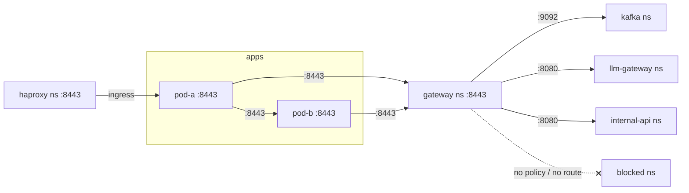

# End-to-end sequence — components, ports, certs, and NetworkPolicy

This document traces a request through the whole stack: the inbound chain
(client → F5 → HAProxy → Pod A → Pod B) and the outbound chain (pods → egress
gateway → external systems), with every endpoint, port, certificate, and the
NetworkPolicy that backs each hop at the kernel level.

> **IPs are illustrative.** Pod and Service IPs are assigned dynamically by
> Kubernetes (Kind defaults: pod CIDR `10.244.0.0/16`, service CIDR
> `10.96.0.0/12`). The names, namespaces, and ports below are exact.

---

## Endpoint reference

| Component | Namespace | Service FQDN | Listen port | Example pod IP | Bind |
|---|---|---|---|---|---|
| test client | `client` | — (pod only) | — | 10.244.3.10 | — |
| f5-sim (nginx) | `f5` | `f5-sim.f5.svc.cluster.local` | 443 (NodePort 30443) | 10.244.1.20 | 0.0.0.0 |
| haproxy | `haproxy` | `haproxy.haproxy.svc.cluster.local` | 8443 | 10.244.1.30 | 0.0.0.0 |
| Pod A Envoy (inbound) | `apps` | `pod-a-service.apps.svc.cluster.local` | 8443 | 10.244.2.40 | 0.0.0.0 |
| Pod A Envoy (egress listeners) | `apps` | — (loopback) | 19080 / 19092 / 14443 / 19094 / 19999 | 10.244.2.40 | 127.0.0.1 |
| Pod A app | `apps` | — (loopback) | 9090 | 10.244.2.40 | 127.0.0.1 |
| Pod B Envoy | `apps` | `pod-b-service.apps.svc.cluster.local` | 8443 | 10.244.2.41 | 0.0.0.0 |
| Pod B app | `apps` | — (loopback) | 9090 | 10.244.2.41 | 127.0.0.1 |
| Egress gateway | `gateway` | `gateway.gateway.svc.cluster.local` | 8443 | 10.244.4.50 | 0.0.0.0 |
| kafka-mock | `kafka` | `kafka-mock.kafka.svc.cluster.local` | 9092 (TCP/TLS) | 10.244.5.60 | 0.0.0.0 |
| llm-gateway-mock | `llm-gateway` | `llm-gateway-mock.llm-gateway.svc.cluster.local` | 8080 | 10.244.6.70 | 0.0.0.0 |
| internal-api-mock | `internal-api` | `internal-api-mock.internal-api.svc.cluster.local` | 8080 | 10.244.7.80 | 0.0.0.0 |
| blocked-mock | `blocked` | `blocked-mock.blocked.svc.cluster.local` | 8080 | 10.244.8.90 | 0.0.0.0 |
| Envoy / gateway admin | — | — (loopback) | 9901 | — | 127.0.0.1 |
| Envoy / gateway health (kubelet) | — | — | 9902 | — | 0.0.0.0 |

### Egress listener → SNI → gateway route map (Pod A and Pod B sidecars)

| App connects to (loopback) | Sidecar cluster | SNI to gateway | Gateway upstream |
|---|---|---|---|
| `127.0.0.1:19080` | `pod_b` (direct) | — (not via gateway) | `pod-b-service.apps:8443` |
| `127.0.0.1:19092` | `gw_kafka` | `kafka` | `kafka-mock.kafka:9092` |
| `127.0.0.1:14443` | `gw_llm_gateway` | `llm-gateway` | `llm-gateway-mock.llm-gateway:8080` |
| `127.0.0.1:19094` | `gw_internal_api` | `internal-api` | `internal-api-mock.internal-api:8080` |
| `127.0.0.1:19999` | `gw_blocked` | `blocked` | *(no route — rejected)* |

---

## Certificate inventory — all signed by one CA: `CN=envoy-test-ca`

| Cert (CN) | Secret (namespace) | Held by | Used as |
|---|---|---|---|
| `test-client` | `client-certs` (`client`) | client pod | client cert → f5-sim |
| `f5-sim` | `f5-sim-certs` (`f5`) | f5-sim | server cert (to client) **and** client cert (to haproxy) |
| `haproxy` | `haproxy-certs` (`haproxy`) | haproxy | `haproxy.pem` — server (to f5) **and** client (to Pod A) |
| `pod-a` | `envoy-certs-pod-a` (`apps`) | Pod A Envoy | server (inbound) **and** client (egress → gateway / Pod B) |
| `pod-b` | `envoy-certs-pod-b` (`apps`) | Pod B Envoy | server (inbound) **and** client (egress → gateway) |
| `gateway` | `gateway-certs` (`gateway`) | egress gateway | server (to pods) **and** client (re-encrypt → upstreams) |
| `mock-target` | `mock-certs` (each mock ns) | kafka / llm / internal / blocked mocks | server cert; SANs cover all four mock FQDNs |
| RS256 private (`jwt.key`) | `envoy-jwt-token` (`apps`) | Pod A/B Envoy **only** | signs `X-Envoy-Internal-JWT` |
| RS256 public (`jwt.pub`) | `app-jwt-pubkey` (`apps`) | Pod A/B app **only** | verifies the JWT |

---

## Sequence diagram

```mermaid
sequenceDiagram
    autonumber
    participant C as Client<br/>client ns 10.244.3.10
    participant F as f5-sim<br/>f5 ns :443
    participant H as HAProxy<br/>haproxy ns :8443
    participant EA as Pod A Envoy<br/>apps ns :8443
    participant AA as Pod A app<br/>127.0.0.1:9090
    participant EB as Pod B Envoy<br/>apps ns :8443
    participant AB as Pod B app<br/>127.0.0.1:9090
    participant GW as Egress GW<br/>gateway ns :8443
    participant K as kafka-mock<br/>kafka ns :9092
    participant I as internal-api<br/>internal-api ns :8080
    participant BL as blocked-mock<br/>blocked ns :8080

    rect rgb(235,245,255)
    Note over C,EA: INBOUND — mTLS terminated + CN whitelisted by the sidecar
    C->>F: TLS to f5-sim.f5.svc:443 (GET /call-kafka)
    Note over C,F: HOP1 mTLS · f5 presents server cert CN=f5-sim ·<br/>client presents CN=test-client · f5 verifies vs CA
    Note over F: extract cert CN → header X-SSL-Client-CN: test-client
    F->>H: HTTP/1.1 to haproxy.haproxy.svc:8443
    Note over F,H: HOP2 mTLS (re-encrypt) · f5 client cert CN=f5-sim ·<br/>haproxy server cert CN=haproxy · header preserved
    H->>EA: to pod-a-service.apps.svc:8443
    Note over H,EA: HOP3 mTLS (re-encrypt) · haproxy client cert CN=haproxy ·<br/>Pod A server cert CN=pod-a · require_client_certificate
    Note over EA: HTTP RBAC: X-SSL-Client-CN==test-client OR src∈10.0.0.0/8 → ALLOW<br/>Lua: inject X-Envoy-Internal-JWT (RS256, signed by jwt.key)
    EA->>AA: HTTP 127.0.0.1:9090 (local_app)
    Note over AA: validate JWT with jwt.pub (iss=envoy-sidecar, exp) → handle /call-kafka
    end

    rect rgb(235,255,235)
    Note over AA,K: EGRESS (allowed) — pod-a → kafka via gateway
    AA->>EA: plain TCP 127.0.0.1:19092 (KAFKA_ADDR)
    EA->>GW: mTLS to gateway.gateway.svc:8443, SNI=kafka
    Note over EA,GW: cluster gw_kafka · Pod A client cert CN=pod-a ·<br/>GW server cert CN=gateway
    Note over GW: tls_inspector: SNI=kafka → filter chain [kafka]<br/>terminate mTLS · network RBAC principal CN∈{pod-a,pod-b} → ALLOW
    GW->>K: mTLS (re-encrypt) to kafka-mock.kafka.svc:9092
    Note over GW,K: cluster up_kafka · GW client cert CN=gateway ·<br/>kafka server cert CN=mock-target (RequireAndVerifyClientCert)
    K-->>AA: PONG ↩ (back through GW → EA → app); app → HTTP 200 to client
    end

    rect rgb(255,240,235)
    Note over AA,I: EGRESS (denied by CN) — pod-a → internal-api
    AA->>EA: plain TCP 127.0.0.1:19094 (INTERNAL_API_ADDR)
    EA->>GW: mTLS to gateway:8443, SNI=internal-api (CN=pod-a)
    Note over GW: filter chain [internal-api] matches · RBAC allowed CN={pod-b}<br/>pod-a ∉ set → DENY → connection reset
    GW--xEA: reset
    Note over AA: callHTTP error → app responds HTTP 502 to client
    end

    rect rgb(255,235,235)
    Note over AA,BL: EGRESS (denied, no route) — pod-a/pod-b → blocked
    AA->>EA: plain TCP 127.0.0.1:19999 (BLOCKED_ADDR)
    EA->>GW: mTLS to gateway:8443, SNI=blocked
    Note over GW: no filter chain for server_names=[blocked]<br/>"no matching filter chain" → connection closed
    GW--xEA: reset
    Note over AA: app responds HTTP 502 (blocked-mock never contacted)
    end

    rect rgb(245,235,255)
    Note over AA,AB: POD A → POD B (direct east-west, NOT via gateway)
    AA->>EA: plain HTTP 127.0.0.1:19080 (POD_B_ADDR)
    EA->>EB: mTLS to pod-b-service.apps.svc:8443
    Note over EA,EB: cluster pod_b · Pod A client cert CN=pod-a ·<br/>Pod B server cert CN=pod-b
    Note over EB: RBAC: no X-SSL-Client-CN on this hop → matches via src∈10.0.0.0/8<br/>Lua injects JWT
    EB->>AB: HTTP 127.0.0.1:9090 → validate JWT → /echo → HTTP 200
    end

    rect rgb(235,255,235)
    Note over EB,I: POD B EGRESS — pod-b → internal-api allowed; → llm denied by CN
    AB->>EB: plain TCP 127.0.0.1:19094
    EB->>GW: mTLS SNI=internal-api (CN=pod-b)
    Note over GW: RBAC allowed CN={pod-b} → ALLOW
    GW->>I: mTLS (re-encrypt) to internal-api-mock.internal-api.svc:8080
    Note over AB,GW: (pod-b → SNI=llm-gateway would be DENIED: allowed CN={pod-a})
    end
```

---

## NetworkPolicy — the kernel-level backstop

NetworkPolicy is enforced by the CNI (Calico) **before any packet leaves a pod's
network namespace**, regardless of which process (app or sidecar) opened the
socket. It is independent of, and complementary to, the Envoy/gateway controls:
even if a workload tried to bypass its sidecar, the kernel drops a packet to a
destination not on its egress allow-list.

Three policies are defined — for the two pods and the gateway. Cross-namespace
selectors use the auto-applied `kubernetes.io/metadata.name` namespace label.

### `pod-a-netpol` (namespace `apps`, selects `app=pod-a`)

| Direction | Peer | Port |
|---|---|---|
| Ingress | namespace `haproxy` | TCP 8443 |
| Egress | `app=pod-b` (same namespace) | TCP 8443 |
| Egress | namespace `gateway`, `app=gateway` | TCP 8443 |
| Egress | (any) — DNS | UDP/TCP 53 |

→ Pod A can reach **only** Pod B (direct) and the gateway. It cannot reach
kafka/llm/internal/blocked directly — only via the gateway.

### `pod-b-netpol` (namespace `apps`, selects `app=pod-b`)

| Direction | Peer | Port |
|---|---|---|
| Ingress | `app=pod-a` (same namespace) | TCP 8443 |
| Egress | namespace `gateway`, `app=gateway` | TCP 8443 |
| Egress | (any) — DNS | UDP/TCP 53 |

→ Pod B accepts traffic only from Pod A, and egresses only to the gateway.

### `gateway-netpol` (namespace `gateway`, selects `app=gateway`)

| Direction | Peer | Port |
|---|---|---|
| Ingress | namespace `apps` | TCP 8443 |
| Egress | namespace `kafka` | TCP 9092 |
| Egress | namespace `llm-gateway` | TCP 8080 |
| Egress | namespace `internal-api` | TCP 8080 |
| Egress | (any) — DNS | UDP/TCP 53 |

→ The gateway accepts traffic only from the `apps` namespace and egresses only
to the three permitted upstream namespaces. **`blocked` is deliberately absent**
— defence in depth on top of the gateway having no SNI route for it.

### Allowed connections (everything else is dropped)



### Notes / scope

- Kubelet liveness/readiness probes (to the `:9902` health listeners) are
  delivered from the node and are not blocked by these ingress rules.
- Only the two pods and the gateway carry NetworkPolicies in this toy stack.
  f5-sim, haproxy, the client, and the mock targets are not policy-restricted —
  in a real deployment you would extend the same pattern (default-deny per
  namespace + explicit allows) to every tier.
- DNS egress (`:53`) is required so Envoy's `STRICT_DNS` clusters can resolve
  the cross-namespace service names.
